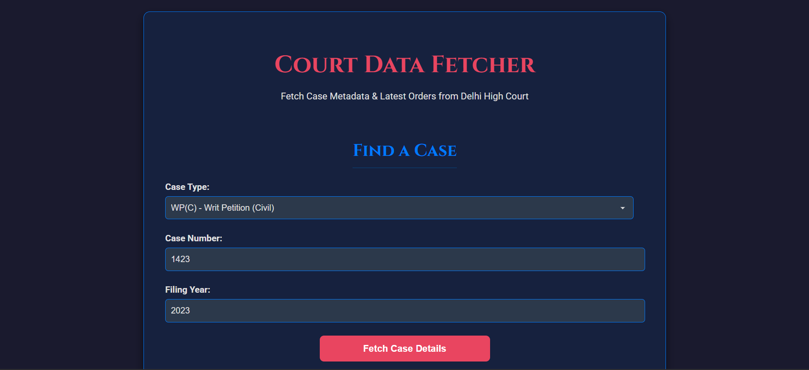
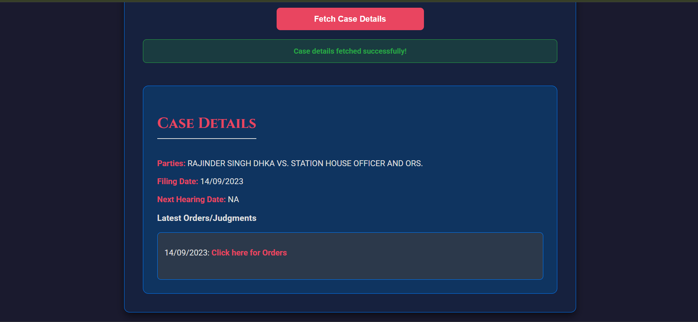

<div align="center">

#  Court Data App

### Legal Case Tracking • Data Retrieval • Structured Information System

<p>
A web application designed to fetch, manage, and display court-related data in a structured and user-friendly format, enabling easy access to legal case information.
</p>

<br/>

<a href="YOUR_LIVE_LINK_HERE" target="_blank">
  
</a>

<br/><br/>


</div>

---

## Overview

**Court Data App** is a web-based system that allows users to access and manage court-related data efficiently.

The application is designed to present structured legal information such as case details, records, or status updates in an organized format, making it easier for users to navigate and retrieve relevant data.

---

## Screenshots

<div align="center">

| Dashboard | Case Details |
|-----------|--------------|
|  |  |

</div>

---

## Explanation of UI

- **Dashboard**  
  Displays a list or summary of court cases. Users can browse available records and select specific entries.

- **Case Details Page**  
  Shows detailed information about a selected case, such as:
  - Case ID / Number  
  - Parties involved  
  - Status  
  - Dates and relevant updates  

This structured layout ensures clarity and ease of navigation.

---

## Key Features

- Fetch and display court-related data  
- Structured presentation of case information  
- Clean and responsive UI  
- Backend-driven data handling  
- Easy navigation between records  
- Organized data storage using database  

---

## Technology Stack

<div align="center">

| Category | Technology |
|----------|-----------|
| Backend |  Python |
| Framework |  Flask |
| Frontend |  HTML |
| Styling |  CSS |
| Database |  SQLite |

</div>

---

## Project Structure

```
11_court_data_app/
├── app.py
├── database/
│   └── db.sqlite3
├── templates/
│   ├── index.html
│   └── details.html
├── static/
│   └── style.css
└── assets/
    ├── dashboard.png
    └── details.png
```

---

## How It Works

1. User opens the application  
2. Backend fetches data from database or source  
3. Data is rendered on the dashboard  
4. User selects a case  
5. Detailed information is displayed  

---

## Getting Started

### Prerequisites

- Python 3.8+  
- pip  

---

### Installation

```bash
git clone https://github.com/priyanildz/Court-Data-App.git
cd Court-Data-App
```

```bash
python -m venv venv
```

```bash
# Windows
venv\Scripts\activate

# macOS/Linux
source venv/bin/activate
```

```bash
pip install -r requirements.txt
```

---

## Run Application

```bash
python app.py
```

Open:

```
http://127.0.0.1:5000
```

---

## Use Cases

- Legal data tracking  
- Case management systems  
- Educational/legal reference tools  
- Backend data handling practice  

---

## Future Improvements

- Search and filtering functionality  
- User authentication  
- API integration for real court data  
- Pagination for large datasets  
- Advanced UI improvements  

---

## License

This project is licensed under the MIT License.

---

<div align="center">

Developed by  
<strong>priyanildz</strong>

</div>